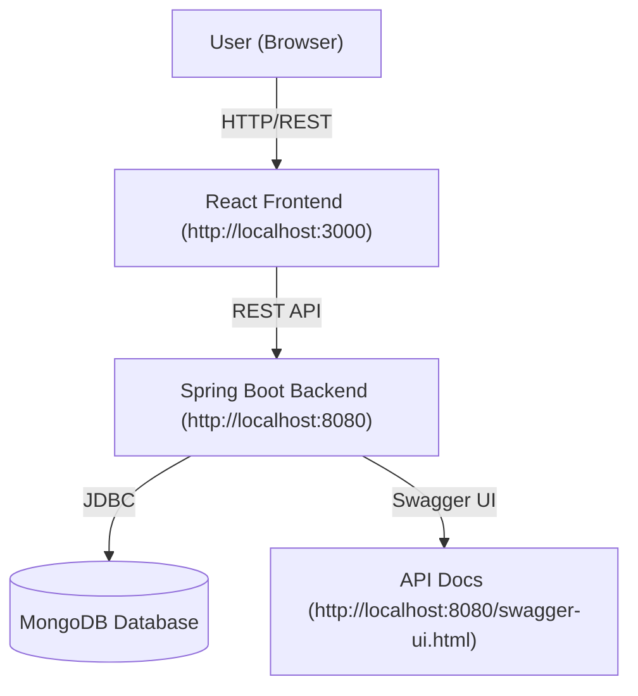

# 🎬 Movie Booking App (Book My Show Clone)

[](https://www.java.com/)
[](https://spring.io/projects/spring-boot)
[](https://react.dev/)
[](https://www.mongodb.com/)
[](https://www.docker.com/)
[](https://swagger.io/tools/swagger-ui/)
[](https://tailwindcss.com/)
[](https://opensource.org/licenses/MIT)

---

## 📚 Table of Contents

- [Tech Stack](#-tech-stack)
- [API Documentation](#-api-documentation)
- [Frontend Preview](#-frontend-preview)
- [App Screenshots](#-app-screenshots)
- [Test Credentials](#-test-credentials)
- [Installation](#️-installation)
- [Docker Installation](#-docker-installation)
- [Architecture](#️-architecture)
- [API Overview](#-api-overview)
- [Database Schema](#-database-schema-mongodb-collections)

---

## 🚀 Tech Stack

| Layer      | Technology         | Badge                                                                 |
|------------|-------------------|-----------------------------------------------------------------------|
| Backend    | Java, Spring Boot |   |
| Frontend   | React, TailwindCSS|   |
| Database   | MongoDB           |  |
| Containerization | Docker |  |
| API Docs   | Swagger/OpenAPI   |  |

---

## 📑 API Documentation

- **Swagger UI:** [https://movie-booking-app.theworkpc.com/swagger-ui.html](https://movie-booking-app.theworkpc.com/swagger-ui/index.html)
- **OpenAPI Spec:** See `API_DOCUMENTATION.md` in the backend folder

---

## 🖥️ Frontend Preview

- **URL:** [https://book-my-show-clone-sandy-five.vercel.app/](https://book-my-show-clone-sandy-five.vercel.app/)
- Modern, responsive UI with full booking flow and admin management

### 📱 App Screenshots

> **Note:** For admin dashboard access, login with admin credentials (admin@moviebooking.com / admin123)

#### 1. Homepage - Movie Catalog


#### 2. Movies Gridview


#### 3. User Authentication


#### 4. Movie Detail and Showtime 


#### 5. Seat Selection


#### 6. Bookings View


---

## 🧪 Test Credentials

> **Note:** If you haven't seeded users, register via the app and set the role in the database.

### **Admin User**
- **Email:** `admin@moviebooking.com`
- **Password:** `admin123`
- **Role:** `ADMIN`

### **Normal User**
- **Email:** `user@moviebooking.com`
- **Password:** `user123`
- **Role:** `USER`

---

## 🛠️ Installation

### Prerequisites
- Java 17 or higher
- Node.js 16+ and npm/yarn
- MongoDB 6.0+
- Docker and Docker Compose (for containerized setup)

### Local Development Setup

1. **Clone the repository**
   ```bash
   git clone <repository-url>
   cd moving-booking-app
   ```

2. **Backend Setup**
   ```bash
   cd movie-booking-backend
   ./mvnw clean install
   ./mvnw spring-boot:run
   ```

3. **Frontend Setup**
   ```bash
   cd movie-booking-frontend
   npm install
   npm start
   ```

4. **Access the application**
   - Frontend: http://localhost:3000
   - Backend API: http://localhost:8080
   - Swagger UI: http://localhost:8080/swagger-ui.html

---

## 🐳 Docker Installation

### Quick Start with Docker Compose

The easiest way to run the entire application stack using Docker:

1. **Clone the repository**
   ```bash
   git clone <repository-url>
   cd moving-booking-app
   ```

2. **Run with Docker Compose**
   ```bash
   docker-compose up -d
   ```

3. **Access the application**
   - Frontend: http://localhost:3000
   - Backend API: http://localhost:8080
   - Swagger UI: http://localhost:8080/swagger-ui.html
   - MongoDB: localhost:27017

### Individual Container Setup

#### Backend Container
```bash
# Build the backend image
cd movie-booking-backend
docker build -t movie-booking-backend .

# Run the backend container
docker run -d \
  --name movie-booking-backend \
  -p 8080:8080 \
  -e SPRING_DATA_MONGODB_URI=mongodb://localhost:27017/moviebooking \
  movie-booking-backend
```

#### Frontend Container
```bash
# Build the frontend image
cd movie-booking-frontend
docker build -t movie-booking-frontend .

# Run the frontend container
docker run -d \
  --name movie-booking-frontend \
  -p 3000:3000 \
  -e REACT_APP_BACKEND_URL=http://localhost:8080 \
  movie-booking-frontend
```

#### MongoDB Container
```bash
# Run MongoDB container
docker run -d \
  --name movie-booking-mongodb \
  -p 27017:27017 \
  -v mongodb_data:/data/db \
  mongo:6.0
```

### Docker Compose Configuration

The project includes a `docker-compose.yml` file that orchestrates all services:

```yaml
version: '3.8'
services:
  mongodb:
    image: mongo:6.0
    ports:
      - "27017:27017"
    volumes:
      - mongodb_data:/data/db
    environment:
      MONGO_INITDB_DATABASE: moviebooking

  backend:
    build: ./movie-booking-backend
    ports:
      - "8080:8080"
    depends_on:
      - mongodb
    environment:
      SPRING_DATA_MONGODB_URI: mongodb://mongodb:27017/moviebooking
      SPRING_PROFILES_ACTIVE: docker

  frontend:
    build: ./movie-booking-frontend
    ports:
      - "3000:3000"
    depends_on:
      - backend
    environment:
      REACT_APP_BACKEND_URL: http://localhost:8080

volumes:
  mongodb_data:
```

### Docker Commands

#### Build Images
```bash
# Build all services
docker-compose build

# Build specific service
docker-compose build backend
docker-compose build frontend
```

#### Manage Services
```bash
# Start all services
docker-compose up -d

# Stop all services
docker-compose down

# View logs
docker-compose logs -f

# View logs for specific service
docker-compose logs -f backend
docker-compose logs -f frontend

# Restart services
docker-compose restart

# Remove containers and volumes
docker-compose down -v
```

#### Development with Docker
```bash
# Run in development mode with hot reload
docker-compose -f docker-compose.dev.yml up

# Access container shell
docker-compose exec backend bash
docker-compose exec frontend sh
```

### Environment Variables

Create a `.env` file in the root directory:

```env
# MongoDB
MONGO_INITDB_DATABASE=moviebooking

# Backend
SPRING_PROFILES_ACTIVE=docker
SPRING_DATA_MONGODB_URI=mongodb://mongodb:27017/moviebooking

# Frontend
REACT_APP_BACKEND_URL=http://localhost:8080
```

### Troubleshooting

#### Common Issues
1. **Port conflicts**: Ensure ports 3000, 8080, and 27017 are available
2. **Memory issues**: Increase Docker memory allocation
3. **Build failures**: Clear Docker cache with `docker system prune`

#### Useful Commands
```bash
# Check container status
docker-compose ps

# View resource usage
docker stats

# Clean up unused resources
docker system prune -a

# Reset everything
docker-compose down -v --remove-orphans
docker system prune -a --volumes
```

---

## 🏗️ Architecture



---

## 📖 API Overview

- **Authentication:** Register, login, JWT-based auth, role-based access (USER, ADMIN)
- **Movies:** List, details, create (admin)
- **Theatres:** List, create (admin)
- **Showtimes:** List, filter, create (admin)
- **Bookings:** Book seats, view/cancel bookings, booking history
- **Health:** Health check endpoint

### Example Endpoints

| Method | Endpoint                       | Description                       |
|--------|-------------------------------|-----------------------------------|
| POST   | `/api/auth/register`          | Register a new user               |
| POST   | `/api/auth/login`             | Login and get JWT                 |
| GET    | `/api/movies`                 | List all movies                   |
| POST   | `/api/movies`                 | Create a new movie (admin)        |
| GET    | `/api/theatres`               | List all theatres                 |
| POST   | `/api/theatres`               | Create a new theatre (admin)      |
| GET    | `/api/showtimes`              | List/filter showtimes             |
| POST   | `/api/showtimes`              | Create a new showtime (admin)     |
| GET    | `/api/bookings`               | Get user bookings                 |
| POST   | `/api/bookings`               | Create a new booking              |
| DELETE | `/api/bookings/{bookingId}`   | Cancel a booking                  |
| GET    | `/api/health`                 | Health check                      |

---

## 🗄️ Database Schema (MongoDB Collections)

### **movies**
```json
{
  "id": "string",
  "title": "string",
  "description": "string",
  "genre": "string",
  "rating": "number",
  "duration": "number",
  "language": "string",
  "posterUrl": "string",
  "releaseDate": "date",
  "createdAt": "date"
}
```

### **theatres**
```json
{
  "id": "string",
  "name": "string",
  "location": "string",
  "totalSeats": "number",
  "rows": "number",
  "seatsPerRow": "number",
  "createdAt": "date"
}
```

---

## 🤝 Contributing

Contributions are welcome! Please feel free to submit a Pull Request. For major changes, please open an issue first to discuss what you would like to change.

1. Fork the Project
2. Create your Feature Branch (`git checkout -b feature/AmazingFeature`)
3. Commit your Changes (`git commit -m 'Add some AmazingFeature'`)
4. Push to the Branch (`git push origin feature/AmazingFeature`)
5. Open a Pull Request

---

## 📜 License

This project is licensed under the MIT License - see the [LICENSE](LICENSE) file for details.

---

<div align="center">

## 💝 Made with Love by Tejas

[](https://github.com/tejasgholap7264)
[](https://linkedin.com/in/tejas07)

---

**⭐ If you found this project helpful, please give it a star! ⭐**

*Built with passion and lots of coffee ☕*

</div>
